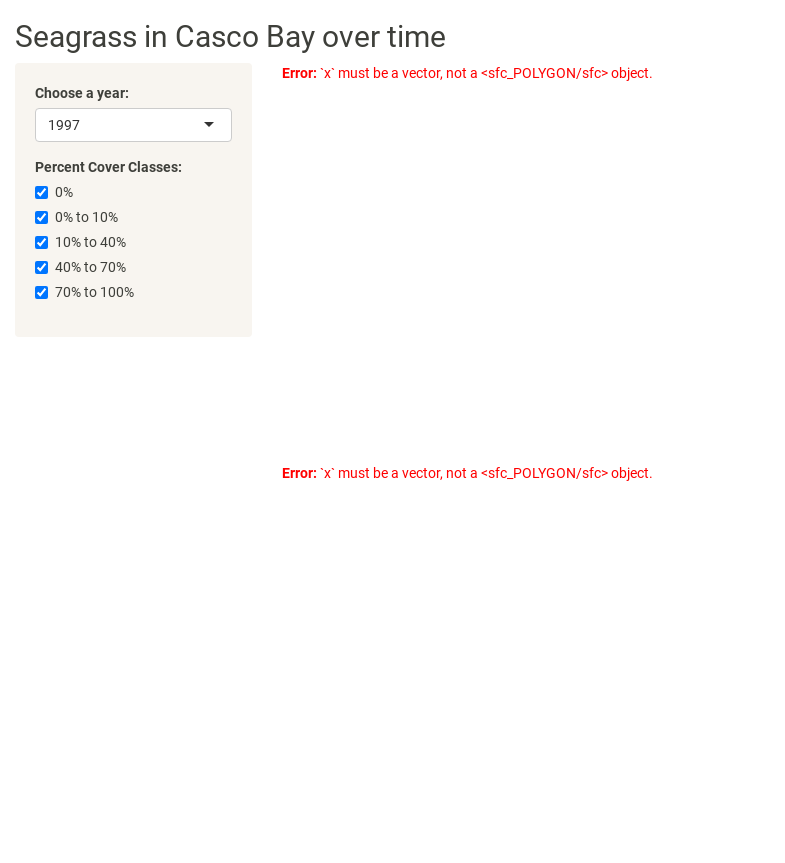

```{.output}
phantomjs has been installed to /home/runner/bin
```

:::::::::::::::::::::::::::::::::::::: questions 

- How do we let users query the data?
- How do we change the data to let the app respond to the user?

::::::::::::::::::::::::::::::::::::::::::::::::

::::::::::::::::::::::::::::::::::::: objectives

- Show how to add inputs and spaces for outputs to an app UI.
- Demonstrate server logic to create custom reactive outputs.

::::::::::::::::::::::::::::::::::::::::::::::::

## Adding Data to Our App Thus Far

So far, we have created an app with a basic layout


```r
# 1. Preamble
library(shiny)
library(shinythemes)

# 2. Define a User Interface
ui <- fluidPage(
  title = "Seagrass in Casco App",
  theme = shinytheme("sandstone"),
  
 titlePanel("Seagrass in Casco Bay over time"),
 
 sidebarLayout(
   sidebarPanel("This is the sidebar"),
   mainPanel("This is the main panel")
 )
)

# 3. define a server
server <- function(input, output) {}

# 4. Call shinyApp() to run your app
shinyApp(ui = ui, server = server)
```


We don't create apps to be static and bare, however. We want this app to explore
data from [Maine DEP surveys of Seagrass Beds](https://www.maine.gov/dmr/science/species-information/eelgrass) through time. 
To make this easier, here we provide a saved `sf` object that is merged seagrass
data through time. Note, this is not a raw shapefile, but rather the result of
some post-processing of the data layers provided by the [Maine GeoLibrary](https://www.maine.gov/geolib/catalog.html).

[You can download the data here](https://cobalt-casco.github.io/r-shiny-geospatial/data/joined_seagrass_cover.Rds). Note how small `.Rds` files are. This was generated with `saveRds()` which can 
save out any R object.

::::::::::::::::::::::::::::::::::::: challenge 

1. To the preamble of your all, load the `sf` package, the `dplyr` package, and
load the data using `readRDS()`. It works 
just like `my_dat <- read.csv("data/my_data.csv)`. Let's call this data 
`seagrass_casco`.

2. Explore the data a bit. What are the columns? What is the projection?
What years are here? 
How many beds are there per year? What are the potential percent cover classes?

::::::::::::::::::::: solution

1. 


```r
library(sf)
library(dplyr)

seagrass_casco <- readRDS("data/joined_seagrass_cover.Rds")
```

2. 

```r
#what is here
str(seagrass_casco)
```

```{.output}
Classes 'sf' and 'data.frame':	4946 obs. of  7 variables:
 $ year     : num  2022 2022 2022 2022 2022 ...
 $ acres    : num  0.0446 0.0608 2.5622 0.7182 0.0182 ...
 $ hectares : num  0.01803 0.02459 1.03688 0.29063 0.00735 ...
 $ cover    : int  1 3 3 3 3 3 1 1 3 4 ...
 $ cover_pct: chr  "0% to 10%" "40% to 70%" "40% to 70%" "40% to 70%" ...
 $ year97   : int  NA NA NA NA NA NA NA NA NA NA ...
 $ geometry :sfc_POLYGON of length 4946; first list element: List of 1
  ..$ : num [1:55, 1:2] -70.2 -70.2 -70.2 -70.2 -70.2 ...
  ..- attr(*, "class")= chr [1:3] "XY" "POLYGON" "sfg"
 - attr(*, "sf_column")= chr "geometry"
 - attr(*, "agr")= Factor w/ 3 levels "constant","aggregate",..: NA NA NA NA NA NA
  ..- attr(*, "names")= chr [1:6] "year" "acres" "hectares" "cover" ...
```

```r
# the years
unique(seagrass_casco$year)
```

```{.output}
[1] 2022 2018 2013 2010 1997
```

```r
# the classes
unique(seagrass_casco$cover_pct)
```

```{.output}
[1] "0% to 10%"   "40% to 70%"  "70% to 100%" "10% to 40%"  "0%"         
```

```r
#beds per year
seagrass_casco |>
  group_by(year) |>
  count()
```

```{.output}
Simple feature collection with 5 features and 2 fields
Geometry type: MULTIPOLYGON
Dimension:     XY
Bounding box:  xmin: -70.24772 ymin: 43.57211 xmax: -69.84399 ymax: 43.93288
Geodetic CRS:  WGS 84
# A tibble: 5 × 3
   year     n                                                           geometry
* <dbl> <int>                                                 <MULTIPOLYGON [°]>
1  1997  1564 (((-69.93372 43.84055, -69.93379 43.84049, -69.93385 43.84038, -6…
2  2010   748 (((-69.87759 43.82806, -69.87764 43.82817, -69.87778 43.82825, -6…
3  2013  1056 (((-70.14101 43.71671, -70.14104 43.71673, -70.14108 43.71673, -7…
4  2018   956 (((-69.87295 43.77136, -69.87298 43.77131, -69.87296 43.77128, -6…
5  2022   622 (((-69.96359 43.79531, -69.96356 43.79534, -69.96355 43.79537, -6…
```

What's interesting about the last one, is that you can see that summarizing 
actions in `dplyr` MERGE THE GEOMETRY within a group. This can be useful at 
at times to have fewer rows to deal with for the same geometry, or for other
spatial operations.

::::::::::::::::::::: 
:::::::::::::::::::::::::::::::::::::  


## Adding Inputs to the UI

Now that we have data, we need to give our user the tools to explore it. Shiny
provides a wide variety of functions to create **Inputs**. These functions all
follow a similar naming convention and structure. The function name will use
camelCase with the first part describing the input, and the second being the 
word "Input" - such as `selectInput()`, `sliderInput()`, and more. 

The function
then takes an `inputID` argument - a string which will be used to refer to the
input later on in the server. Then a `label` argument, for what the user will
see as the text describing the input. Finally, a wide variety of input specific
arguments. For example, see the following from [Dean Attali's tutorial](https://docs.google.com/presentation/d/1dXhqqsD7dPOOdcC5Y7RW--dEU7UfU52qlb0YD3kKeLw/edit#slide=id.gd53c66aaf_0_157).


For the purposes of our app, let's begin by adding a `selectInput()` to allow a 
user to choose a year.

::::::::::::::::::::::::::::::::::::::::: callout

It would have been nice to have a slider for year. But, base Shiny doesn't 
have a function for that. You'd need `sliderTextInput()` from [shinyWidgets](https://dreamrs.github.io/shinyWidgets/).

::::::::::::::::::::::::::::::::::::::::: 

Looking at `?selectInput` we see we will need the following arguments:

- `inputId` - a name for our input
- `label` - what the user sees
- `choices` - some choices for years. This can just be the `unique()` years from 
our data.
- `selected = NULL` - an default first year. For the moment, we will set it to
the first year in our data.

Let's insert the following in our `sidebarPanel()`, replacing the text that was
there, and see what it produces. 


```r
selectInput(
  inputID = "year",
  label = "Choose a year:",
  choices = unique(seagrass_casco$year) |> sort(),
  selected = unique(seagrass_casco$year) |> min() #to get the earliest year
)
```

You will note that we are using the data to populate this form. This is good 
practice so that you don't enter a value into your select that isn't found in the
data, which can cause havoc. We also used `sort()` so that our selector was in
order.


::::::::::::::::::::::::::::::::::::::::: challenge

# Challenge: More inputs!

Add a `checkboxGroupInput()` with `inputId = "cover"`. Have it show all cover
classes, in order, and default to them all starting checked off

:::::::::::::::::::::: solution


```r
checkboxGroupInput(
  inputId = "cover",
  label = "Percent Cover Classes:",
  choices = unique(seagrass_casco$cover_pct) |> sort(),
  selected =  unique(seagrass_casco$cover_pct) |> sort()
)
```


:::::::::::::::::::::: 
::::::::::::::::::::::::::::::::::::::::: 


This is just the start of `*Input()` possibilities. Shiny itself hosts a number 
of inputs, and there are multiple packages that host other possible inputs.


## Adding Placeholders for Outputs

Before we get to the business of creating outputs, we need to have Shiny tell 
us where in the UI the outputs will be placed. To do this, much like the 
`*Input()` functions, we have a series of `*Output()` functions that will generate
HTML placeholders for where different outputs should go.

|     Function        |     Output Type        |
|---------------------|------------------------|
| plotOutput()        | plot, ggplot         |
| tableOutput()       | table or data frame  |
| uiOutput()          | Shiny UI element     |
| textOutput()        | text                 |
| htmlOutput()        | HTML code            |
| leaflet::leafletOutput() | leaflet map     |

Like inputs, these functions have a first argument - in this case `outputId` 
which is a character string, and will be used elsewhere in the app. Other arguemtns to these functions vary by output, but can be used to do things like specify 
output window size, scaling, and more.  For the moment, let's add two `plotOutput()` 
windows to our app. One for a map - called "map" and one for a histogram, called
"hist". This will go in our `mainPanel()` as follows:


```r
   mainPanel(
     plotOutput("map"),
     plotOutput("hist"),
   )
```

Note, if we had wanted to make these side by side, we could have used `column()`
or even gone hard on HTML with tables.

Render your app to make sure it works, but you will see that these areas will 
currently appear blank.


## Servers and the Output

It is now time to dig into our server. Recall the code for the server looks like
this:


```r
# 3. define a server
server <- function(input, output) {}
```

It's just an empty creation of a function. What happens inside the function is
what interests us. Note that the function takes two arguments - `input` and 
`output`. These are the names of lists that are part of the Shiny environment.

The list `input` stores all of the inputs from the `*Input()` functions in the UI.
The list `output` will contain all of the outputs generated by functions in the
server to then plug into the UI above. All of the IDs we have in our `ui` will 
be used as parts of these lists. So, `input$year` will contain the value of year
chosen. `output$map` will contain the plot of a map to be displayed in the UI.

So how do we generate output? Throughout our server we need to continually add
pieces to the `output` list that match what is in the UI. These pieces should 
be generated by a series of `render*()` functions. We have functions like 
`renderPlot()`, `renderTable()`, etc. Note how they are in many ways the inverse
of the `*Output()` functions above. `render` comes first - which is useful as it
reminds you that you are working in the server. But then the type of output being
generated has a direct match with a `*Output()` function above. It makes it 
easy to search back and forth and to find matching functions and elements.


*an example render function from Dean Attali*


Note in the above function the argument to `renderPlot()` is enclosed in `{}`.
What? Curly braces? Why? Who? Don't worry. Think of them like fences to enclose
a block of code. That block of code is then passed to `renderPlot()` as a single
argument. The function knows how to handle and parse it. But, it only wants one
lump of code to work on. Formally, this argument is named `expr`, but, that 
rarely gets used. As with all other functions, `render*()` functions have other
arguments that can be supplied to fine-tune how they are executed.

Let's modify our server to have sections for our outputs.


```r
# 3. define a server
server <- function(input, output) {
  
  # our map block
  output$map <- renderPlot({
    
  })

  # our histogram block
  output$hist <- renderPlot({
    
  })

    
}
```

Now, in each block, we will need to filter our seagrass data down based on input
selection. This is going to require two `dplyr::filter()` operations. The first
to subset to year. The second to subset to only those cover percent classes that 
are in the cover percent selector. For both of these, we will reference our 
`input` list - `input$year` and `input$cover`.  Let's add that filter operation
to both code blocks.


```r
# 3. define a server
server <- function(input, output) {
  
  # our map block
  output$map <- renderPlot({
    
    dat <- seagrass_casco |>
      filter(year == input$year) |>
      filter(cover_pct %in% input$cover)
    
  })

  # our histogram block
  output$hist <- renderPlot({

    dat <- seagrass_casco |>
      filter(year == input$year) |>
      filter(cover_pct %in% input$cover)
  })

    
}
```

Note, because these are two separate code blocks, we can reuse the object name
`dat`. In our next lesson, we will talk about how to minimize copying and pasting code.

Finally, for each block, let's add a `ggplot()`. In the first, we will make 
a map based on `geom_sf()` with a good polygon width and a viridis color scale. 
For the second, we will look at the hectares of each bed.


```r
# 3. define a server
server <- function(input, output) {
  
  # our map block
  output$map <- renderPlot({
    
    dat <- seagrass_casco |>
      filter(year == input$year) |>
      filter(cover_pct %in% input$cover)
    
    ggplot() +
      geom_sf(data = dat,
              linewidth = 1.5, 
              color = "darkgreen")
    
  })

  # our histogram block
  output$hist <- renderPlot({

    dat <- seagrass_casco |>
      filter(year == input$year) |>
      filter(cover_pct %in% input$cover)
    
    ggplot(data = dat,
           aes(x = hectares)) +
      geom_histogram(bins = 50)
  })

}
```

Before you try and run this, remember to add `library(ggplot2)` to your preamble.


```{.output}

Listening on http://127.0.0.1:8785
```

:::::::::::::::::::::::::::::::::: callout

Sometimes `==` in filters makes Shiny behave strangely with other libraries.
You can use `%in%` instead and get the same effect.

::::::::::::::::::::::::::::::::::



::::::::::::::::::::::::::::::::::::: discussion

And there you have it! A basic app! In groups of 3-4, play with the app and 
discuss

1) What do you learn from playing with this app?

2) What would you change? How would you modify this to make it better. 
Can you implement any of that? Or ask the instructors/google for 
potential solutions.

::::::::::::::::::::::::::::::::::::: 


::::::::::::::::::::::::::::::::::::: keypoints 

- There are many types of inputs and outputs available for Shiny apps.
- Inputs follow a basic structure of having a `*Input()` function with standard arguments in the UI.
- Outputs have a placeholder in the UI using a `*Output()` function.
- Outputs are rendered in the server with a `render*()` function.
- The server has two lists to work with - `input` and `output` - which contain information for both.
     
::::::::::::::::::::::::::::::::::::::::::::::::
