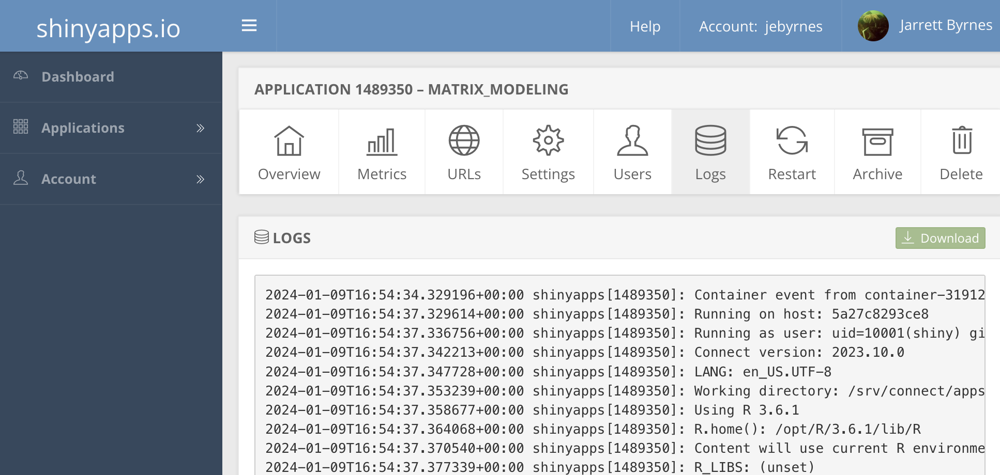

:::::::::::::::::::::::::::::::::::::: questions 

- How do I show the world my Shiny apps?

::::::::::::::::::::::::::::::::::::::::::::::::

::::::::::::::::::::::::::::::::::::: objectives

- Publish your Shiny app

::::::::::::::::::::::::::::::::::::::::::::::::

## Shinyapps.io

In order to make your Shiny apps available to the world, we need to put them
somewhere publicly accessible on the Worldwide Web. In order to do this, we need
a Shiny Server - a server running R that knows how to deploy Shiny apps. While
those of you with a server and know-how can deploy your own [Shiny Server](https://posit.co/products/open-source/shinyserver/) (it's free!), that's
generally not an option for everyone.

For our purposes, we're going to use Posit's [shinyapps.io](https://shinyapps.io), 
a free Shiny App hosting site that is integrated into R Studio.

::::::::::::::::::::::::::::::::::::: challenge

## Sign up for shinyapps.io

Go to [shinyapps.io](https://shinyapps.io) and take the steps to register for 
an account.

::::::::::::::::::::::::::::::::::::: 

::::::::::::::::::::::::::::::::::::: callout

## Other hosting options if you don't run a server

There are other ways, but they require more technical expertise. If you are at
or affiliated with a university, contact your scientific computing staff. They
can setup a Shiny Server and Rstudio Server so you can easily deploy apps by
uploading them.

If you don't have that option, and shinyapps.io is not enough for you, you can
[deploy your app with Heroku](https://www.john-mcallister.com/deploy-r-shiny-applications-on-heroku/) or [Digital Ocean](https://hosting.analythium.io/how-to-host-shiny-apps-on-the-digitalocean-app-platform/). It's going to take some work, patience, and desire to learn more about
systems administration. Skills well worth learning.

::::::::::::::::::::::::::::::::::::: 

## Deploying Your App to Shinyapps.io

*How to Publish your Shiny App from Dean Attali*

Deploying your app from within RStudio is fairly simple. Within Rstudio, click 
the funky botton noted above (to the left of your code pane) and select 
`Publish Application`. You will be walked through steps to connect your instance
of RStudio to [shinyapps.io](https://shinyapps.io) and then the app will upload.

Run your app. If it has a problem, log into [shinyapps.io](https://shinyapps.io)
and inspect the logfile for your app to see what went wrong.

::::::::::::::::::::::::::::::::::::: keypoints 

- Use shinyapps.io in conjunction with Rstudio to make your app public.
     
::::::::::::::::::::::::::::::::::::::::::::::::
