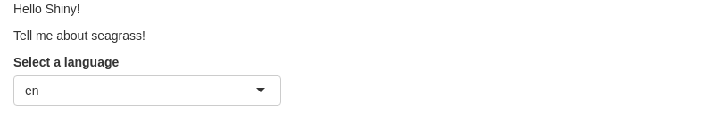

:::::::::::::::::::::::::::::::::::::: questions 

- How do I make my Shiny App accessible to non-English speakers?

::::::::::::::::::::::::::::::::::::::::::::::::

::::::::::::::::::::::::::::::::::::: objectives

- Implement drop-down translations for Shiny

::::::::::::::::::::::::::::::::::::::::::::::::

## The Problem of Language

The entire world does not speak English.

While many developers might not be working in English, the default interface 
for Shiny contains many pieces that *ARE* in English. A wide variety of words 
that are programmed in, or are common terms of art that a developer might use are
in English. Moreover, content written by a developer could well be in English.

While a user *can* use Google Translate - and might have to for more complex 
grammer - giving them the power to even select translation for the main words in
your UI can be help broaden your audience. Here we will explore two translation
packages for Shiny. We will start with a simple app which we can put in a file
`app-translate.R`.

```
library(shiny)
library(shi18ny)
  
ui <- fluidPage(
  h1("hello"),
  h3("to the world"),
  br(),
  tags$blockquote("more text")
  )
  
server <- function(input, output) {

}
```

## Translating with `shi18ny`, Modules, and Reactives

[shi18ny](https://github.com/datasketch/shi18ny) is an older, but fairly solid,
word-for-word translation engine. It has a [large dictionary](https://github.com/datasketch/shi18ny/blob/master/data-raw/ui-translations.csv) 
of ~1,000 words in 18 languages. It's not going to help with complex grammer, 
but it's idea for simple interfaces. Let's start by adding two pieces to the 
UI to get the language selector working. The first is `useShi18ny()`. This just
loads a lot of HTML code that will be needed to do the translations. The second
is a new input, `langSelectorInput()`. We will use the `position = "Fixed"` 
argument in order to have it not move around as we scroll the page.

```
ui <- fluidPage(
  
  #language selector
  useShi18ny(),
  langSelectorInput("lang", position = "fixed", width = 200),


  h1("hello"),
  h3("to the world"),
  br(),
  tags$blockquote("more text")
)

```

That doesn't *seem* to do anything, but that's because translation is a bit 
different than other actions.

As the translation is dynamic, we can see that we want our translation to be reactive.
Unlike [reactives we have already looked at](r-shiny-geospatial/04-reactives.html),
something different is going on. First, we need to have a language translation system
setup in the background. This seems like a block of code we could read in, but, 
we will need to place it in a specific context of a server or UI. This is a 
concept called a [Shiny module](https://shiny.posit.co/r/articles/improve/modules/).

So we will `callModule(langSelector)` with some additional arguments for 
`langSelector`. One of which is `i18n` - the list of languages. Let's see how
we implement this with the server. See ?`langSelector` for more.

Last, we need a call to `observeEvent()` to make sure the reactive change is seen.
We have talked previously about reactives. We can get the value from a reactive
anytime in our code using the function `observe({})`. This is very useful
as within the code block, we can insert some debug output - such as printing
the value of a reactive out.  `observeEvent({})` is similar, save that it 
responds whenever a reactive experiences something "event-like". It's useful for
things like reactive buttons (to re-run a simulation), or changing reactive 
dropdowns.

In this case, whenever the language chosen is changed, the languages have to
update across the entire page. Including the UI. So, we need to run 
`uiLangUpdate()` with arguments to the classes the library makes available and
a call to the module itself.

```
server <- function(input, output) {
    # the language list
    i18n <- list(
      defaultLang = "en",
      availableLangs = c("es", "en", "pt")
    )
    
    # Call language module and save it as a reactive
    lang <- callModule(langSelector, "lang", i18n = i18n, showSelector = TRUE)
    
    observeEvent(lang(),{
      uiLangUpdate(input$shi18ny_ui_classes, lang())
    })
}
```


Now, changing the language selector didn't actually change any of the words. 
This is because Shiny needs to know WHICH words should be translated. For this, 
we use the function `ui_()`. The function takes a single string or vector of 
strings and, as long as each have a match in the translation table, it will
translate them as needed.


```
ui <- fluidPage(
  
  #language selector
  useShi18ny(),
  langSelectorInput("lang", position = "fixed", width = 200),


  h1(ui_("hello")),
  h3(ui_("to"), ui_("the"), ui_("world") ),
  br(),
  tags$blockquote(ui_("more"), ui_("text"))
)

```

The continued repetition of the `ui_()` function gets a bit annoying here. There
are two solutions. Either provide the phrase you want translated in an additional
translation YAML file in a directory or an additional CSV file in a directory
called "locale". Or, we can make a `uiOutput()` and have the server do some 
parsing of language with the `i_()` function.

So, we can change our UI to


```
ui <- fluidPage(
  
  #language selector
  useShi18ny(),
  langSelectorInput("lang", position = "fixed", width = 200),
  h1(ui_("hello")),

  uiOutput("more_text")

)

```

And our server to
```
server <- function(input, output) {
    # the language list
    i18n <- list(
      defaultLang = "en",
      availableLangs = c("es", "en", "pt")
    )
    
    # Call language module and save it as a reactive
    lang <- callModule(langSelector, "lang", i18n = i18n, showSelector = TRUE)
    
    observeEvent(lang(),{
      uiLangUpdate(input$shi18ny_ui_classes, lang())
    })
    
    output$more_text <- renderUI({
      list(
      h3(i_(c("to", "the", "world"), lang = lang())|> paste0(collapse = " ")),
      br(),
      tags$blockquote(i_(c("more", "text"), lang =lang())|> paste0(collapse = " "))
      )
    })

}
```

## Translating Phrases with `shiny.i18n`

Going word by word can be tedious. What about whole phrases? What if you have
huge blocks of text and want to translate them - say, a whole description. Enter
the [shiny.i18n](https://appsilon.github.io/shiny.i18n/index.html) library. This
library makes it simple for you to provide custom translations for phrases and
then tag them. You can supply these as either a CSV or a [JSON](https://www.json.org/json-en.html) file - a bunch of nested `{}` lists.

For example, here's a CSV


```csv
en,it
Hello Shiny!,Ciao Shiny!
Tell me about seagrass!, Parlami delle erba marina!
```

This is fairly straightforward, and you can do it easily in excel, etc.
BUT - for big, multi-line text blocks, it might become a bit of a pain in terms 
of line overruns, etc.


```json
{
  "languages": ["en", "it"],
  "translation": [
      {
        "en": "Hello Shiny!", 
        "it": "Ciao Shiny!"},
      {
        "en": "Tell me about seagrass!",
        "it": "Parlami delle erba marina!"
      }
    ]
}
```

Let's [download this json file](seagrass_it.json) into our toplevel directory.

`shiny.i18n` is a bit simpler to use than `shiny18ny`, but similar in the how it
integrates into an app. First, we need to greate a `Translator` object in our
preamble. Do do this, we use `Translator$new()` to initialize a new Translator 
object. We then use this new object to set the language for the environment. 
Note, our Translator is something called an [R6 object](https://adv-r.hadley.nz/r6.html), which you don't need to
worry about, save that it contains functions within itself. Welcome to a soft
introduction to [Object Oriented Programming](https://en.wikipedia.org/wiki/Object-oriented_programming).


```r
# 1. Preamble
library(shiny)
library(shiny.i18n)

# Initialize the translator
trans_lang <- Translator$new(translation_json_path = "seagrass_it.json")
```

```{.error}
Error: lexical error: invalid char in json text.
                                       seagrass_it.json
                     (right here) ------^
```

```r
trans_lang$set_translation_language("en")
```

```{.error}
Error in eval(expr, envir, enclos): object 'trans_lang' not found
```

Now that we have a translator setup in our preamble, `trans_lan`, we can use it
in our UI. First, we need to use the function `usei18n(trans_lang)` - our
translator object - to import a bunch of code that will handle the translation.
Then, in our UI, any phrase that can be translated can be wrapped into
`trans_lang$t()` which R will be able to translate later. Finally, we need to
put a selector for the language. To get the choices for the languages available
we can use `trans_lang$get_languages()`.


```r
# 2. User interface
ui <- fluidPage(
  #import javascript
  usei18n(trans_lang),
  
  # the UI
  p(trans_lang$t("Hello Shiny!")),
  p(trans_lang$t("Tell me about seagrass!")),
  
  # A selector
  selectInput(
    "choose_language",
    "Select a language",
    choices = trans_lang$get_languages(),
    selected = "en"
  )
  
)
```

```{.error}
Error in eval(expr, envir, enclos): object 'trans_lang' not found
```

So, how do we make languages change? This is another case where we need to use
`observeEvent()` to observe a change in a reactive and trigger a shange across
the app. The function to change languages is `update_lang()` which takes the
argument of the new language - here from `input$choose_language`.


```r
# 3. Server
server <- function(input, output) {
  observeEvent(input$choose_language,{
    update_lang(input$choose_language)
  })
}
```

Putting these pieces together, we now have an app that can run and switch
languages for large phrases.


```{.error}
Error in eval(expr, envir, enclos): object 'ui' not found
```

```{.error}
Error in eval(expr, envir, enclos): object 'i18n_app' not found
```



::::::::::::::::::::::::::::::::::::: keypoints 

- Use `shi18ny` for common/app-related single or a few words across many languages. 
- use `shiny.18n` to make translation selectors for large chunks of text where you create the dictionary.
     
::::::::::::::::::::::::::::::::::::::::::::::::
