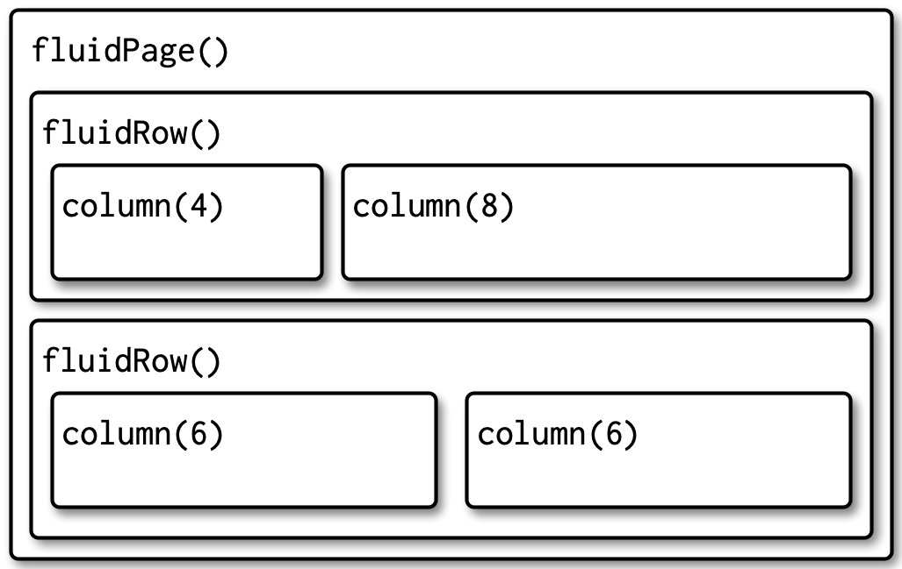

```{r setup, echo=FALSE}
source("setup.R")
knitr::opts_chunk$set(fig.height = 8, 
                      warning = FALSE, 
                      message = FALSE)
library(webshot)
```

:::::::::::::::::::::::::::::::::::::: questions 

- How do we build a User Interface?

::::::::::::::::::::::::::::::::::::::::::::::::

::::::::::::::::::::::::::::::::::::: objectives

- Learn how to add elements to a UI.

- Discover the different layouts and lewks you can create with Shiny.

::::::::::::::::::::::::::::::::::::::::::::::::

How do we make things show up in our user interface? The R Shiny ecosystem
provides a dynamic [layout ecosystem](https://shiny.posit.co/r/articles/build/layout-guide/) about which [much has been written](https://mastering-shiny.org/action-layout.html). It's also
constantly being updated and extended by other packages. Here we will begin to 
add code to our blank app to begin to build something useful to explore data
regarding seagrass beds in Casco Bay.

## Adding Text to the UI

Starting with our blank app, what happens if we add a little text to the
`fluidPage()`

```{r first-text, eval = FALSE}
# 1. Preamble
library(shiny)

# 2. Define a User Interface
ui <- fluidPage(
  "An app about seagrass.",
  "Different Years"
)

# 3. define a server
server <- function(input, output) {}

# 4. Call shinyApp() to run your app
shinyApp(ui = ui, server = server)
```


```{r first-text-out, echo = FALSE, eval = TRUE, results = "hide"}
# 1. Preamble
library(shiny)

# 2. Define a User Interface
ui <- fluidPage(
  "An app about seagrass.",
  "Different Years"
)

# 3. define a server
server <- function(input, output) {}

# 4. Call shinyApp() to run your app
first_text <- shinyApp(ui = ui, server = server)

appshot(first_text, "shiny_figs/first_text.jpeg",
        vwidth = 400,
        vheight = 300)
```


FYI, from this point forward, we will just show the parts of the app we are 
working on, rather than the whole thing.

So, the above is nice. But, 1) It's just small text and 2) the webpage didn't have 
a title. How can we make it look better?

First, note that 

```{r}
fluidPage(
  "An app about seagrass.",
  "Different Years"
)
```

outputs HTML code again. Within `fluidPage()` we can either add HTML code 
directly with the `HTML()` function. Or, if you don't know/want to learn HTML,
Shiny comes with a number of functions that will generate valid HTML code. You
can look these up with `?tags` or with `names(tags)`. Note, the later will show
even more possible functions, but for many of them, you have to use `tags$*()`.

For example:

```{r}
fluidPage(
  h1("An app about seagrass."),
  br(),
  h3("Different Years")
)
```

Generates one big header, a line break, and a smaller header. Let's add this to
our UI and see what it looks like.

```{r}
ui <- fluidPage(
  h1("An app about seagrass"),
  br(),
  h3("Over time")
)
```

```{r, echo = FALSE,  eval = TRUE, results = "hide"}
ui <- fluidPage(
  h1("An app about seagrass"),
  br(),
  h3("Over time")
)

html_text <- shinyApp(ui = ui, server = server)

appshot(html_text, "shiny_figs/html_text.jpeg",
        vwidth = 640,
        vheight = 480)
```


If we want our app to have a title, we can give it one as well.


```{r}
ui <- fluidPage(
  title = "Seagrass in Casco App",
  h1("An app about seagrass"),
  br(),
  h3("Over time")
)
```

Note how every piece is separated by a comma. 

::::::::::::::::::::::::::::::::::::: Challenge 

Explore `names(tags)` and use different functions to create a small website
you like. You can look at `?tags` to get information about some of them, or
just play with `tags$*()` to format things in different ways. If a tag can
take other arguments, you can supply them as arguments to the function. 
If you have no idea what any of this might mean, check out 
[this html reference](https://www.w3schools.com/tags/).

::::::::::::::: Solution

For example

```{r}
ui <- fluidPage(
  title = "Seagrass in Casco App",
  tags$strong("I am strong"),
  br(),
  tags$blockquote("Here I quoteth from the finest."),
  br(),
  a("Maine Historical Eeelgrass Viewer", href = "https://maine.maps.arcgis.com/apps/MapSeries/index.html?appid=ac2f7b3d29b34268a230a060d6b78b25")
)
```

:::::::::::::::
::::::::::::::::::::::::::::::::::::: 

## Adding a Theme
To see the different pieces of the layout as we move forward, we're also
going to add a theme. A theme isn't necessary, but can often make things 
shine. The `bslib` package proves a dynamic tool to make themes. However, 
to do so quickly, we recomment [shinythemes](https://rstudio.github.io/shinythemes/).
Let's add the `sandstone` theme. 


```{r}
library(shinythemes)

ui <- fluidPage(
  title = "Seagrass in Casco App",
  theme = shinytheme("sandstone"),
  
  h1("An app about seagrass"),
  br(),
  h3("Over time")
)
```

We don't see it making a huge difference yet, but notice how the font changes. 
Themes are another great example of an item that one can find many resouces on,
but it's a rabbit hole you can become lost inside of.

## Adding Layouts to the UI

Rather than hand-coding all of the HTML in a page, Shiny provides a number of 
functions that will create dynamic interfaces and blocks of HTML code for you.
Check out [Posit's guide to layouts](https://shiny.posit.co/r/articles/build/layout-guide/) for a fairly comprehensive guide or [this chapter from Mastering Shiny](https://mastering-shiny.org/action-layout.html).
For our purposes, we will use the classic sidebar layout. Let's start by taking
our raw text and making a title panel.

```{r title-panel}
ui <- fluidPage(
  title = "Seagrass in Casco App",
  theme = shinytheme("sandstone"),
  
 titlePanel("Seagrass in Casco Bay over time")
)
```


To that, we will use a classic `sidebarLayout()`. Within a `sidebarLayout()` we
also need to add a `sidebarPanel()` and `mainPanel`, as otherwise the layout 
would just be a blank box.


*The nesting of a sidebar layout from [Mastering Shiny](https://mastering-shiny.org/action-layout.html*

```{r}
ui <- fluidPage(
  title = "Seagrass in Casco App",
  theme = shinytheme("sandstone"),
  
 titlePanel("Seagrass in Casco Bay over time"),
 
 sidebarLayout(
   sidebarPanel("This is the sidebar"),
   mainPanel("This is the main panel")
 )
)
```

```{r run-sidebar-layout, echo = FALSE,  eval = TRUE, results = "hide"}
sidebar_shiny <- shinyApp(ui = ui, server = server)

appshot(sidebar_shiny, "shiny_figs/sidebar_layout.jpeg",
        vwidth = 800, vheight = 600)
```


::::::::::::::::::::::::::::::::::::: Challenge 

You might have noticed that there is an inherent column/row layout here. Fluid
pages are structured using fluid rows and columns nested within fluid rows. 
There are 12 units of width across a fluid row. Using `fluidRow()` and `column()`
make a UI with 3 rows, 3 columns in row 1, 2 in row 2, and 1 in row 3. All 
dividing the row equally. Put text into them to see the results.

Note, you might have to stretch your viewing window to see it.


*A multirow layout from [Mastering Shiny](https://mastering-shiny.org/action-layout.html#multi-row)*

::::::::::::::: Solution

```{r row-col-ui}

ui <- fluidPage(
  fluidRow(
    column(4, 
      "1,1"
    ),
    column(4, 
      "1,2"
    ),
    column(4, 
      "1,3"
    )
  ),
  fluidRow(
    column(6, 
     "2,1"
    ),
    column(6, 
      "2,2"
    )
  ),
  fluidRow(
    column(12, 
      "3,1"
    )
  )
)
```

:::::::::::::::
::::::::::::::::::::::::::::::::::::: 


::::::::::::::::::::::::::::::::::::: keypoints 

- We can add text and HTML to our Shiny apps using functions.
- Shiny has a built-in theming system to make professional looking apps.
- Our fluid pages are composed of multiple functions that control overall layout.
     
::::::::::::::::::::::::::::::::::::::::::::::::
